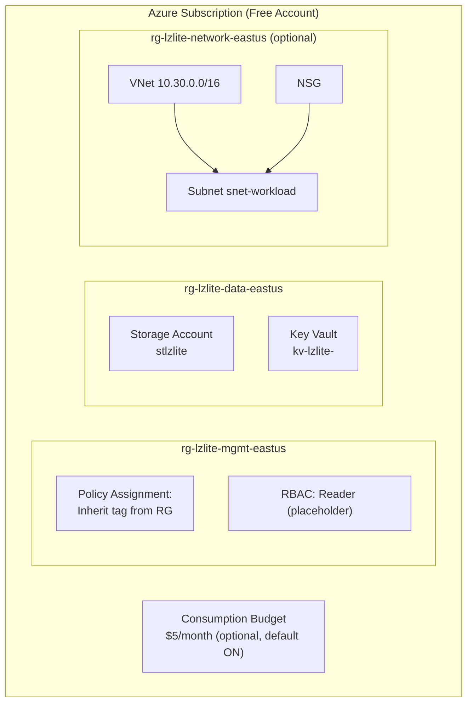

# LandingZoneLite


A PowerShell-driven toolkit that deploys a small, cost-aware **landing zone lite** foundation —
resource group structure, standard tags, an RBAC pattern, a policy assignment, an optional
budget/alert, a storage account, a Key Vault, and an optional spoke-ready network — the kind of
foundational governance work every enterprise cloud team does when onboarding a new environment,
team, or workload, scaled down to run safely and repeatedly on an **Azure Free Account**.

> **Recruiter-friendly summary:** I built a repeatable landing-zone bootstrap tool in PowerShell
> that mirrors Microsoft's Cloud Adoption Framework (CAF) landing zone principles — resource
> segmentation, tagging governance, RBAC, policy-as-code, and cost guardrails — complete with
> idempotent automation, a mocked Pester v5 test suite, and a GitHub Actions CI pipeline, safely
> runnable end-to-end on a free Azure account.

## Architecture overview



See [`docs/architecture.md`](docs/architecture.md) for the full component diagram, deployment
sequence diagram, and governance model.

## Prerequisites

- PowerShell 7.0+
- [Az PowerShell module](https://learn.microsoft.com/en-us/powershell/azure/install-az-ps)
  (`Install-Module -Name Az -Scope CurrentUser`)
- An Azure subscription (a [Free Account](https://azure.microsoft.com/free/) is sufficient)
- [Pester v5.5+](https://pester.dev/) for running tests (`Install-Module -Name Pester
  -MinimumVersion 5.5.0 -Force -SkipPublisherCheck`)

## Things you must edit before running

Open `config/landingzone.config.json` and replace every placeholder value:

| Key | Why you must change it |
|---|---|
| `subscriptionId` | Placeholder GUID; must match your real subscription |
| `ownerTag` | Placeholder email; used as the `Owner` tag for traceability |
| `costCenterTag` | Placeholder code; adjust to something meaningful, or leave for a personal sandbox |
| `uniqueSuffix` | Placeholder text; generate a real 6-char lowercase suffix (see below) — storage accounts and Key Vaults require globally unique names |
| `rbacPrincipalObjectId` | Placeholder GUID; replace with a real Azure AD object ID, or leave as-is and accept the RBAC step will log a warning and continue |
| `contactEmail` | Placeholder email; used for budget alert notifications |

Generate a unique suffix:

```powershell
-join ((97..122) | Get-Random -Count 6 | ForEach-Object {[char]$_})
```

## Deployment steps (Azure Cloud Shell copy-paste)

```powershell
# 1. Clone/copy the repo into Cloud Shell, then:
cd project-a-landing-zone-lite

# 2. Edit config/landingzone.config.json (see above), then verify context:
Get-AzContext

# 3. Dry-run first (recommended):
./scripts/deploy.ps1 -WhatIf

# 4. Deploy for real:
./scripts/deploy.ps1

# 5. Validate:
./scripts/validate.ps1

# 6. Clean up when done:
./scripts/cleanup.ps1 -Force
```

## Example commands

```powershell
# Plain deploy: mgmt + data resource groups, storage, Key Vault, policy, budget
./scripts/deploy.ps1

# Deploy including the optional spoke-ready network
./scripts/deploy.ps1 -IncludeNetwork

# Dry run — shows every change without making any
./scripts/deploy.ps1 -WhatIf

# Deploy without the budget (skip Cost Management Contributor requirement)
./scripts/deploy.ps1 -IncludeBudget:$false
```

## Validation steps + expected output

```powershell
./scripts/validate.ps1
```

Produces a PASS/FAIL markdown table on the console and writes a timestamped copy to
`../logs/validation-report-<timestamp>.md`. Exits with code `1` if any check fails (suitable as a
CI gate). See [`samples/sample-validation-report.md`](samples/sample-validation-report.md) for a
realistic example of the expected output, and
[`docs/validation-checklist.md`](docs/validation-checklist.md) for the full manual checklist.

## Cleanup steps

```powershell
./scripts/cleanup.ps1 -WhatIf          # preview what would be removed
./scripts/cleanup.ps1 -Force            # remove everything, no prompts
./scripts/cleanup.ps1 -Force -PurgeKeyVault  # also permanently purge the soft-deleted Key Vault
```

Removal order is dependency-safe (locks → RBAC → policy → budget → Key Vault → storage → network
→ resource groups) and fully idempotent — safe to re-run against a partially-cleaned environment.

## Cost notes

| Component | Classification | Notes |
|---|---|---|
| Resource groups, tags | Free | No cost for the containers or metadata themselves |
| RBAC role assignment | Free | Azure RBAC has no direct cost |
| Policy assignment | Free | Azure Policy evaluation is free |
| Consumption budget + alert | Free | Cost Management budgets/alerts are a free feature |
| Storage account (Standard_LRS) | Low-cost pay-as-you-go | Not covered by the $200/30-day credit once that expires; a few GB of blob storage is fractions of a cent/month |
| Key Vault | Low-cost pay-as-you-go | Billed per operation/secret; a demo secret and occasional reads cost well under $0.01/month |
| Spoke VNet/subnet/NSG (`-IncludeNetwork`) | Free | VNets, subnets, and NSGs themselves have no direct cost; costs only appear if you attach billable resources (VMs, gateways, peering data transfer) |
| Azure Free Account credit | 12-months-free / $200 credit | New accounts get a $200/30-day credit plus 12 months of select free-tier services; this project intentionally avoids anything metered beyond that (no VMs, no B-series compute) |

This project deploys **no compute** (no VMs, no App Service, no AKS), which is why it fits
comfortably within a Free Account with near-zero ongoing cost — the only genuinely metered items
are trivial storage/Key Vault operation charges.

## Security notes

- The storage account enforces secure transfer (HTTPS-only), TLS 1.2 minimum, and disables public
  blob access by default — never loosen these without understanding the exposure.
- The Key Vault uses RBAC authorization (not legacy access policies) with soft-delete enabled;
  purging is a separate, explicit opt-in (`-PurgeKeyVault`) in `cleanup.ps1`.
- `rbacPrincipalObjectId` and any other object IDs in `config/landingzone.config.json` are
  placeholders — never commit real tenant object IDs, subscription IDs, or secrets to a public
  repository. Treat the demo secret `SampleAppSetting` as exactly that: a demo value, never a real
  credential.
- The RBAC and policy steps are scoped to resource groups created by this tool, not the whole
  subscription, to minimize blast radius.

## Troubleshooting

See [`docs/troubleshooting.md`](docs/troubleshooting.md) for common issues: missing Az context,
non-fatal RBAC warnings, storage/Key Vault name collisions, policy definition lookup failures,
budget permission errors, and CI version mismatches.

## How to demo this project

See [`docs/demo-guide.md`](docs/demo-guide.md) for a full 10-minute walkthrough script (dry-run
deploy, Pester suite, validation report, CI workflow).

## What this proves to an employer

See [`docs/employer-value.md`](docs/employer-value.md) for the full breakdown. Summary:

- CAF landing zone thinking (resource segmentation, tagging taxonomy, RBAC pattern)
- Governance-as-code (real Azure Policy assignment, validated programmatically)
- Idempotent automation (check-then-create everywhere, full `-WhatIf` support)
- Cost discipline (explicit cost classification, optional pieces off by default, free budget alerts on by default)
- Testing discipline (mock-based Pester v5 suite, GitHub Actions CI with PSScriptAnalyzer gating)

## Skills demonstrated

Azure Resource Manager automation, Az PowerShell module, Azure governance (tags/RBAC/Policy),
Azure Cost Management budgets, PowerShell module authorship, idempotent infrastructure patterns,
Pester v5 mock-based testing, GitHub Actions CI for PowerShell, technical documentation with
Mermaid diagrams.

## Future enhancements

- Bicep/ARM template parity for a "compare imperative vs. declarative" companion demo
- Management group and multi-subscription support for a true enterprise-scale landing zone
- Azure Monitor diagnostic settings and Log Analytics workspace integration
- Support for hub-spoke VNet peering once a hub network is available to peer against
- Parameterizable tag taxonomy via a JSON schema with validation
- Multi-region deployment support beyond `eastus`

## Suggested GitHub repo description

> A PowerShell toolkit that deploys a cost-aware Azure landing zone lite foundation — RGs, tags, RBAC, policy-as-code, budget, storage, Key Vault, and optional network — safely runnable on a free Azure account.

## Suggested repo topics

`azure`, `powershell`, `landing-zone`, `governance`, `iac`, `devops`, `az-104`,
`cloud-architecture`, `cost-management`, `pester`

## License

[MIT](LICENSE)
