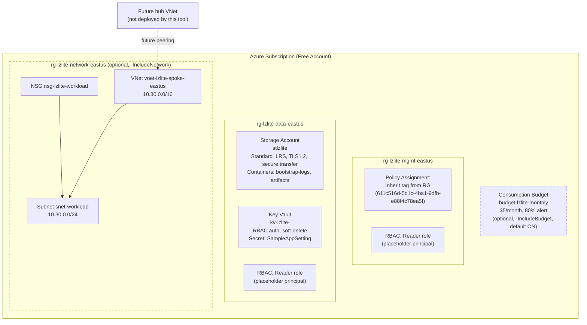
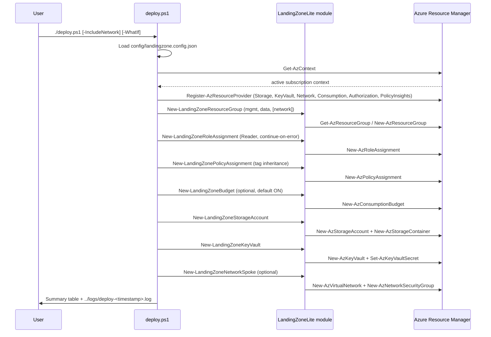

# Architecture

## Overview

LandingZoneLite deploys a small, cost-aware foundation that mirrors the core structural ideas of
Microsoft's [Cloud Adoption Framework (CAF) landing zones](https://learn.microsoft.com/en-us/azure/cloud-adoption-framework/ready/landing-zone/) —
resource group segmentation by function, consistent tagging, an RBAC pattern, policy-driven
governance, and cost guardrails — scaled down so it can be deployed safely and repeatedly inside
an Azure Free Account.

The design intentionally separates **management**, **data**, and **network** concerns into
distinct resource groups, the same segmentation principle used in full-scale landing zones (where
these might instead be entire subscriptions). Everything optional and resource-count-growing
(the spoke network) is off by default; everything free or near-free (tags, policy, budget) is on
by default.

## Component diagram

## Deployment flow

## Resource groups

| Resource Group | Purpose | Created by default? |
|---|---|---|
| `rg-lzlite-mgmt-eastus` | Governance surface: policy assignment, RBAC pattern | Yes |
| `rg-lzlite-data-eastus` | Storage account, Key Vault | Yes |
| `rg-lzlite-network-eastus` | Spoke VNet, subnet, NSG | No — only with `-IncludeNetwork` |

## Tagging strategy

Every resource group and resource receives the same standard tag set, applied via
`ConvertTo-LzTagHashtable` (private helper) and `Set-LandingZoneTags` (public function):

| Tag | Example value | Purpose |
|---|---|---|
| `Environment` | `sandbox` | Environment classification; also the tag enforced by the policy assignment |
| `Project` | `LandingZoneLite` | Fixed value identifying resources owned by this toolkit |
| `Owner` | `your-name@example.com` | Traceability to a human owner |
| `CostCenter` | `CC-0000` | Cost allocation |
| `ManagedBy` | `PowerShell` | Signals automation-managed, not manually created |
| `DeployDate` | `2026-07-21` | ISO date stamp at deploy time |

## Governance-as-code

The policy assignment uses Azure's built-in **"Inherit a tag from the resource group if missing"**
definition (ID `611c516d-5d1c-4ba1-9dfb-e88f4c78ea5f`), assigned at the `rg-lzlite-mgmt-eastus`
scope with `tagName = Environment`. This means any resource created in scope without an
`Environment` tag automatically inherits it from its resource group — a lightweight, non-blocking
governance guardrail appropriate for a "lite" landing zone (the deprecated "Require a tag on
resources" definition is intentionally not used).

## Idempotency model

Every `New-LandingZone*` function in `src/LandingZoneLite/Public` follows the same
check-then-create pattern: query for the resource by name/scope, return the existing object
unchanged if found, otherwise create it. Combined with `SupportsShouldProcess` (`-WhatIf`/
`-Confirm`), this makes `deploy.ps1` safe to re-run against a partially-deployed or fully-deployed
environment without duplicating resources or failing on "already exists" errors.
